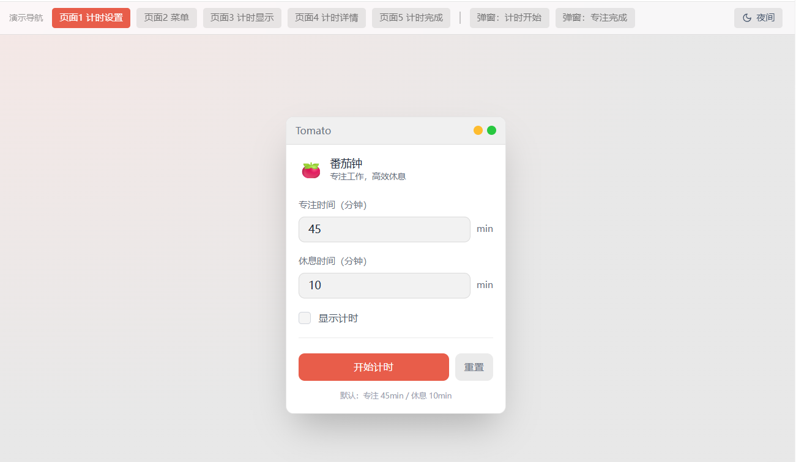
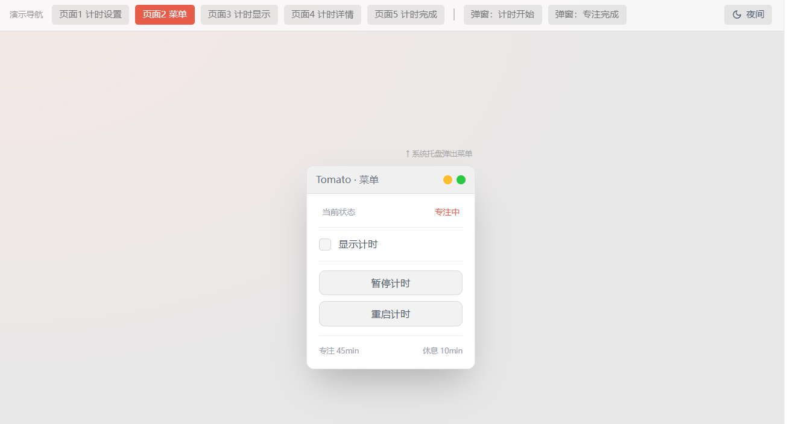
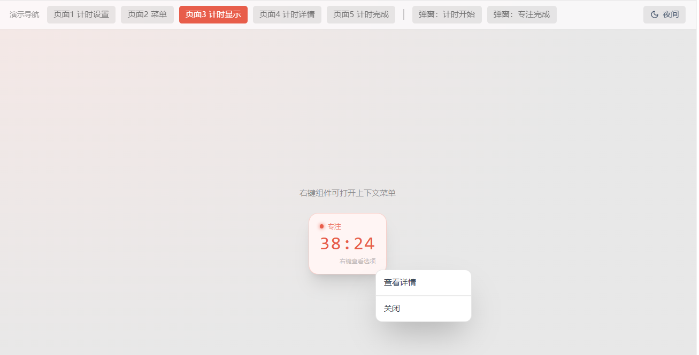
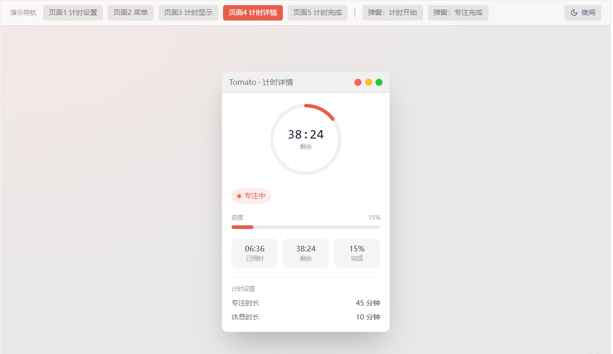
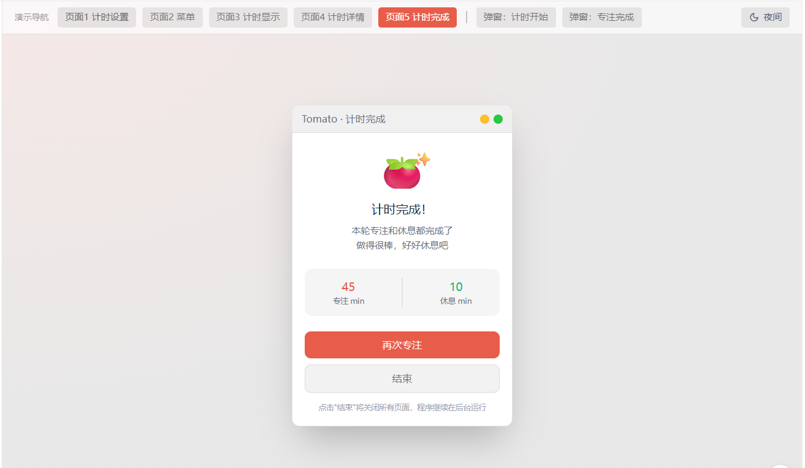

# 番茄钟需求分析

tomato是一个具有计时功能的学习番茄钟，开发平台为Windows

特点：简单，隐身

- 简单：只需要完成核心功能，不做额外功能
- 隐身：只在必要时出现。开启计时后，tomato默认隐藏，不显示任何内容，不影响用户工作。用户可以按热键，显示tomato的菜单窗口或计时显示窗口

# 计时功能

## 页面

有5个页面和一系列弹出窗口

### 页面1：计时设置页面

- 打开方式：初次打开tomato软件，进入计时设置页面

- 页面布局：

  

- 用户可做的操作：

  1. 用户输入专注时间、休息时间，可选“显示计时”，完成计时设置
  2. 用户点击“开始计时”，开启计时
  3. 用户点击“重置设置”，各项设置都被清空

- 默认设置：tomato应该提供默认标准时间设置：专注时间45min、休息10min

计时设置需要进行保存，后续用户可能对计时设置做修改，但在这一轮计时过程中，计时设置始终只有一份

### 页面2：菜单页面

- 打开方式：
  1. 用户在计时过程中，在Windows的“显示的隐藏图标”中选择“打开菜单”
  2. 用户可以点击热键，直接打开菜单页面
  
- 页面布局：

  

- 用户可做的操作：
  1. 用户勾选“显示计时”，右下角弹出 计时显示窗口
  2. 用户取消勾选”显示计时“，计时显示窗口会消失
  3. 用户点击“暂停计时"，tomato暂停当前计时
  4. 用户点击“恢复计时”，tomato会恢复被暂停的计时，继续计时
  5. 用户点击“重启计时”，tomato会重新开始本轮计时
  
- 组件逻辑：
  1. 用户点击“暂停计时“后，原暂停计时按钮 变化为 “恢复计时“按钮

### 页面3：计时显示页面

- 打开方式：
  1. 在计时设置页面 或 菜单页面中，用户勾选“显示计时”，右下角会出现 计时显示页面
  2. 用户在计时过程中，可以在Windows的“显示的隐藏图标”中选择“打开计时显示”
  3. 用户可以使用热键，直接打开计时显示页面
  
- 页面布局：

  

  > 要求：该页面是一个半透明的悬浮窗倒计时，是可以拖拽的，并在左上角标注当前计时状态

- 用户可做的操作：
  1. 用户将鼠标停留在计时页面上，右键，选择”查看详情“，会弹出计时详情页面，显示当前的进度条信息，以及当前处于的状态、计时设置信息
  2. 用户将鼠标停留在计时页面上，右键，选择“关闭”，即可关闭计时显示页面

### 页面4：计时详情页面

- 打开方式：

  1. 用户将鼠标停留在计时页面上，右键，选择”查看详情“，弹出计时详情页面
  2. 用户使用热键，直接打开计时详情页面

- 页面布局：

  

### 页面5：计时完成页面

- 打开方式：
  1. 本次计时完成时（包括专注和休息），自动弹出计时完成页面
  
- 页面布局：

  

- 用户可做的操作：
  1. 用户点击“再次专注”，将自动跳转到计时设置页面，设置页面 默认被填充为上一次专注的设置
  2. 用户点击“结束”，关闭tomato的所有页面，但不关闭tomato程序本身，tomato还在后台运行

### 弹出窗口

1. 计时开始提示：

   - 弹出时机：用户点击“计时开始”时，右下角弹出“计时开始”

   - 页面显示时间：显示5s后，页面自动关闭
2. 专注计时完成提示

   - 弹出时机：专注计时完成时，右下角弹出“专注结束，该休息啦”，并伴随两次滴滴声，提醒用户

   - 页面显示时间：显示1min后，页面自动关闭

## 场景

### 场景1：简单计时场景

1. 运行tomato：用户打开tomato.exe，运行tomato程序
2. 设置计时：打开tomato后，会显示计时设置页面，用户填写专注时间、休息时间。若用户不修改，直接使用默认值
3. 启动计时：用户点击“启动计时”，页面右下方弹出计时开始提示。此时tomato关闭页面，进入后台运行
   - 若用户勾选“显示计时”，则此时会在屏幕右下角弹出 计时显示页面
4. 查看计时：用户使用热键 或 在Windows的“显示的隐藏图标”中选择”打开计时显示“，可以查看当前的剩余时间
5. 查看计时详细情况：用户在计时显示页面上右键，选择“查看详情”，会弹出一个详情窗口，包括进度条、当前状态、计数设置等信息
6. 专注计时结束：当专注计时结束时，屏幕右下方弹出专注计时完成提示。tomato进入休息计时
7. 计时结束：休息计时也完成时，本轮计时完成。屏幕中间弹出计时完成页面
   - 若用户点击再次专注，则页面变为计时设置页面
   - 若用户点击结束，则直接退出，关闭所有页面

### 场景2：停止计时后，再恢复计时场景

在计时过程中，用户使用热键 或 在Windows的“显示的隐藏图标”中选择”打开菜单“，可以对计时状态进行调整

1. 停止计时：用户点击“停止计时”，tomato停止计时
2. 恢复计时：用户点击“恢复计时”，tomato从停止的时间点处继续计时

### 场景3：重启计时场景

在菜单页面中，用户点击“重启计时“，tomato恢复到计时刚启动的状态，即重新从专注计时下开始计时

# 交付要求

1. 开发阶段：需要编写功能测试，确保每个功能点都能够通过测试，且UI界面交互有效
2. 发布阶段：最终的产品是一个可以直接双击运行的可执行文件，你需要将代码打包成相应的可执行文件，使其运行在Windows桌面上
